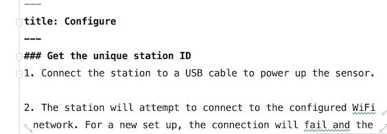

# sensor.community website

:sparkles: new shiny website for dust and noise measuring project :point_right: sensor.community

## How to install
### Prerequisites

* [Node.js (v11+)](https://nodejs.org/)
* [Yarn (optional)](yarnpkg.com)

## Get started

inside the folder install the dependencies...

```bash
npm install
```

or with yarn

```bash
yarn install
```

...then start [Rollup](https://rollupjs.org):

```bash
npm run dev or sapper dev
```

alternative use yarn
```bash
yarn install
yarn dev or sapper dev
```

Navigate to [localhost:3000](http://localhost:3000). 
You should see your app running. Edit a component file in `src`, save it, and reload the page to see your changes.

By default, the server will only respond to requests from localhost. To allow connections from other computers, edit the `sirv` commands in package.json to include the option `--host 0.0.0.0`.

### Getting started with Svelte & Sapper
Website is based on [Svelte 3](https://svelte.dev) and [Sapper](https://sapper.svelte.dev).
Please consider reading the documentation.

## Translation

**1. Create locale file**

duplicate `locales/en.json` file and rename it to language by [iso-3166-alpha2](https://en.wikipedia.org/wiki/ISO_3166-1) coding, for example *fr* for French.
Translate the **values** in the locale file:
```javascript
{
    "nav": {
      "home": "Accueil", <- "Accueil" is the value
        ...
    },
```

Now duplicate `content/airrohr/en` folder and rename it again to language by [iso-3166-alpha2](https://en.wikipedia.org/wiki/ISO_3166-1) coding.
Also duplicate `content/dnms/en`for the DNMS guide. Translate both 



It's written in markdown. To get used to the markdown syntax, visit [www.markdownguide.org](https://www.markdownguide.org/getting-started/).

**FYI** You can leave the filename. The title will be taken from the beginning of each file, see picture above.

**2. Add new language to the init18n.js**

Go to `src/utils/initI18n.js`. Add the new language, in this case it's French.
First add the path to the locale file, then add it to the resources.

```javascript
import fr from '../../locales/fr';  // path to the locale file

function initI18n(lng = 'en') {
  i18next.init({
    lng,
    resources: {
      en,
      de
      de,
      fr
    },
```

 Go to `src/routes/[lang]/_layout.svelte`  and extend the array with the new language.
 ```html
<script context="module">
    const LANGUAGES = ["en", "de", "fr"];  // <- add new lanuage in the array
    const DEFAULT_LANGUAGE = "en";
    export async function preload(page) {...
```

**3. Add language to the navbar**

To add the language in the navbar go to `src/components/LanguageSwitcher.svelte`. Scroll down to around Line 24 and add this line with the corresponding language.

```javascript
const langauges = [
        "gb", "de", "fr", "it", "sk", "ru" // <- add new lanuage in the array
    ]
```

**4. Add endpoints**

 Duplicate inside `src/routes/endpoints/airrohr` or `src/routes/endpoints/dnms`  then `en` folder to the [iso-3166-alpha2](https://en.wikipedia.org/wiki/ISO_3166-1), e.g. `fr`. Inside the `index.json.js` file change line 8.
 
 ````javascript
import send from '@polka/send';
import generate_docs from '../../../../utils/generate_docs.js';

let json;

export function get(req, res) {
    if (!json || process.env.NODE_ENV !== 'production') {
        json = JSON.stringify(generate_docs('airrohr/fr'));  // <- change the lanuage iso-code 
    }

    send(res, 200, json, {
        'Content-Type': 'application/json'
    });
	
}

````


## Bugs and feedback
The website is in early development, and may have the rough edge here and there. 

## Deployment
```bash
yarn export or sapper export
```

copy content of `__sapper__/export` to a ftp server

Happy coding :tada: :raised_hands:
